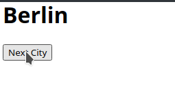

# React-Flux-Sample

## Description

A simple react app that displays different predefined city names.
When you click the "Next City"-Button, the next city will be loaded and displayed.  
  
The App is build on facebooks flux architecture with the components:
* Dispatcher
* Store
* Action 
* View 

## Preview

# File Explanation

## [ActionTypes.js](flux-sample/src/architecture/ActionTypes.js)

* Enum with all available action types

## [CityStore.js](flux-sample/src/architecture/CityStore.js)

* Holds all available cities
* Holds the current selected city-index
* Provides a method to get the current selected city
* Registers itself at the Dispatcher 

## [ArchitectureRegistry.js](flux-sample/src/architecture/ArchitectureRegistry.js)

* Creates Dispatcher
* Creates CityStore and passes dispatcher to store

## [App.js](flux-sample/src/App.js)

* React-JSX Component
* Passes NEXT_CITY-Action to Dispatcher
* Fetches current city from CityStore
* Registers a listener for changes of CityStore